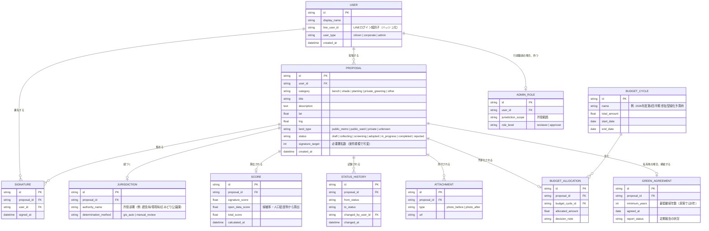

# 02. データモデル — GreenVoice TOKYO

前提：[01-requirements.md](./01-requirements.md) の機能要件（F1〜F10）を満たすためのデータ構造。実装時のDB選定は [04-architecture.md](./04-architecture.md) を参照。

## 1. ER図（概念モデル）

## 2. 補足（設計上の判断根拠）

- **`PROPOSAL.land_type` を早期に持たせる理由**：原案の「①縦割り行政・管轄の壁」への対処として、GIS位置情報から公有地/私有地・所管を自動タグ付けする方針（[01-requirements.md](./01-requirements.md) F9）をデータ構造から担保する。
- **`SCORE` を `PROPOSAL` から分離した理由**：署名数は随時変動し、オープンデータ側の指標も更新され得るため、スコアは再計算可能な独立エンティティとして履歴管理できるようにする（原案の「②声の大きさによる偏り」への対処＝単純な署名数順ではなく複合指標にするため）。
- **`STATUS_HISTORY` を持つ理由**：原案の「公共デザインの視点：民主的統制」（判断根拠の透明化・異議申立て可能性）に対応するため、ステータス変更を誰が・いつ行ったかを追跡可能にする。
- **`GREEN_AGREEMENT` を独立エンティティにした理由**：原案の「③私有地緑化の権利と維持管理」対策（緑地協定の締結を助成要件化）をデータとして表現する。
- **`BUDGET_CYCLE` / `BUDGET_ALLOCATION` は実際の会計処理と分離**：[01-requirements.md](./01-requirements.md) のスコープ定義どおり、実予算執行（振込等）は対象外のため、あくまで「決定を記録する」台帳としてのみ扱う。

## 3. MVPで簡略化する点（要検証）

- `SCORE.open_data_score` の算出式は、実際に取得できたオープンデータ指標（[03-external-integration.md](./03-external-integration.md)）によって変わるため、MVP実装時に確定させる（現時点では緑被率・人口密度を仮の指標として想定）。
- `JURISDICTION.determination_method` は当面 `manual_review` を許容し、GIS自動判定（`gis_auto`）は対象エリアが確定してから有効化する。
