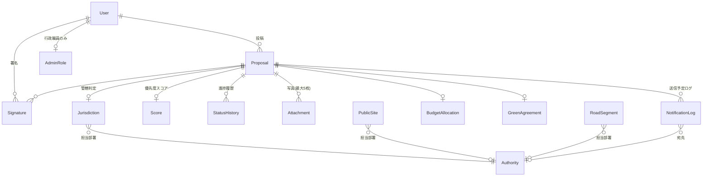

# 02. データモデル

Prismaスキーマは `app/prisma/schema.prisma`。ローカル開発はSQLite(`app/prisma/dev.db`、gitignore対象)。SQLiteはネイティブenumを持たないため、enum相当の値は`String`型カラム+`app/src/lib/enums.ts`のリテラル型で型安全性を担保している。

## ER図(概略)

`PublicSite`は`Proposal`と外部キーでは結ばれていない(投稿作成時に選択した施設の緯度経度・土地種別を`Proposal`側へコピーする設計)。

## モデル一覧

### User
`displayName`(本名。行政ダッシュボードのみ表示)、`handle`(公開ID。都民向け画面はこちらのみ表示)、`userType`(`citizen`|`admin`)。

### Proposal
提案本体。`category`・`landType`・`status`は文字列カラム(`lib/enums.ts`のリテラル型で検証)。`landType`は投稿時に選んだ`PublicSite`の値がそのままコピーされる。

### Signature
`@@unique([proposalId, userId])`で1提案1署名を保証。

### Attachment
提案の写真。`type`は`photo_before`/`photo_after`。新規投稿は1〜5枚の`photo_before`を作成する(`app/prisma/ingest/`ではなく`(citizen)/proposals/new/actions.ts`側)。

### StatusHistory
ステータス変更の履歴。`fromStatus`がnullの行が「投稿(初期状態)」を表す。

### Score
`signatureScore`(署名数ベース)+`openDataScore`(土地種別・カテゴリ等から算出)の合成値`totalScore`。計算ロジックは`app/src/lib/scoring.ts`。

### Jurisdiction
提案の管轄判定結果。`authorityId`(`Authority`への参照、判定できた場合のみ)と`authorityName`(表示用の非正規化キャッシュ)を両方持つ。`determinationMethod`は`site_match` / `road_match` / `ward_fallback` / `manual_review`。

### Authority(F9本格版)
管轄先の実体(部署)。`category`(`park`|`road`|`private`|`other`)、`ward`(都道府県道・都立施設担当はnull)、`contactEmail`(実在確認できたもののみ。無ければnull)、`sourceNote`(部署名・連絡先の出典メモ)。`app/prisma/ingest/seedAuthorities.ts`で投入する。

### PublicSite
都・区市町村が管理する公園・図書館・道路のマスタ。新規提案フォームの「区市→施設名」選択、および管轄自動判定の近傍一致に使う。`sourceUrl`(オープンデータの出典URL。手打ちデータはnull)、`authorityId`(取り込み時に紐付け済みの担当部署)。**23区中18区・約3,700件**が東京都オープンデータの実データ(`app/prisma/ingest/fetchParks.ts`)、残りは元からの手打ちデータ。

### RoadSegment
道路網データのキャッシュ用に用意したモデル(`roadTypeCode`/`roadTypeLabel`/`geometry`など)。**現時点では未投入(空テーブル)**。国土交通省「国土数値情報」道路データ(N01)の生きた配布リンクが見つからず、代替のN06は高速道路専用データだったため、実データを取り込めていない。詳細は[05-roadmap.md](./05-roadmap.md)。

### NotificationLog
「将来、管轄先へ自動でメール送信したい」の土台。`status`は`planned`のみ(実送信ロジックは未実装)。新規提案が作成され`Jurisdiction.authorityId`が特定できるたびに1件作成される。

### BudgetCycle / BudgetAllocation / GreenAgreement
予算枠・予算配分・緑地協定(私有地緑化の継続年数管理)。現状はシードデータのみで、専用の操作画面はまだ無い。

### AdminRole
行政職員の担当スコープ。`jurisdictionScope`は表示用の自由文字列、`authorityId`(`Authority`への参照、nullable)が実際の絞り込みキー。`authorityId`が設定されている行政職員は、その`Authority`が管轄する提案(`Jurisdiction.authorityId`一致)のみダッシュボード一覧・詳細ページで閲覧でき、ステータス変更もその範囲に限られる。`authorityId`が`null`の場合は全域担当として全提案を閲覧・操作できる(シードデータでは「東京都 建設局 担当者」のみがこの全域担当)。
