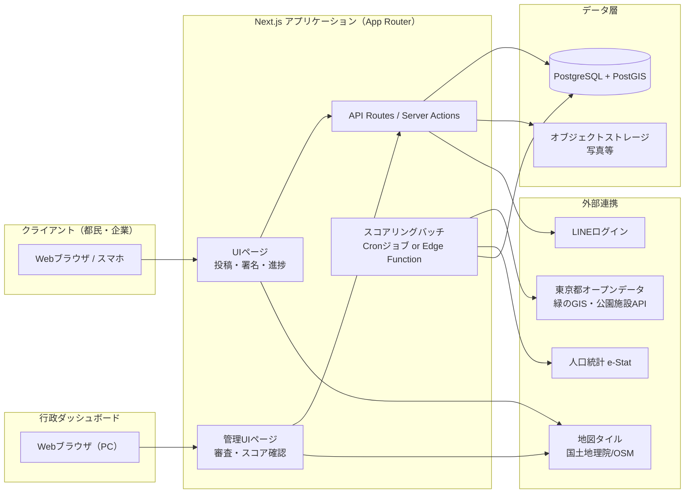

# 04. 技術アーキテクチャ — GreenVoice TOKYO

前提：技術スタックはヒアリングにより **Next.js（React）+ TypeScript** に確定済み。データモデルは [02-data-model.md](./02-data-model.md)、外部連携は [03-external-integration.md](./03-external-integration.md) を参照。

## 1. 全体構成

## 2. レイヤー別の技術選定

| レイヤー | 選定 | 理由 |
| --- | --- | --- |
| フロントエンド／サーバー | Next.js（App Router）+ TypeScript | フロントエンドとAPIを一体で構築でき、ハッカソン〜実証実験規模の開発速度に適する |
| 地図表示 | MapLibre GL JS + 国土地理院タイル/OSM | オープンソースでライセンスコストがなく、GeoJSON（GISデータ由来）の重畳表示に適する |
| DB | PostgreSQL + PostGIS拡張 | 位置情報（管轄自動判定、GISデータとの突合）を扱うため地理空間クエリが必要 |
| ORM | Prisma（PostGIS拡張は生SQL/rawクエリ併用） | TypeScriptとの親和性、スキーマ管理のしやすさ |
| 認証 | Auth.js（NextAuth）+ LINEプロバイダ | LINEログインを主とする方針（[03-external-integration.md](./03-external-integration.md)）に合致 |
| ファイルストレージ | S3互換オブジェクトストレージ | 投稿写真・完了報告写真の保存 |
| スコアリング処理 | Next.jsのScheduled Function／Cronジョブ（ホスティング環境依存） | 署名数・オープンデータ更新に応じた定期再計算 |
| ホスティング（候補） | Vercel（アプリ）+ Supabase等のマネージドPostgreSQL（PostGIS対応） | 要検証：行政実証実験フェーズでは国内データセンター要件が課される可能性があるため、Phase2以降でホスティング先を再評価する |

## 3. ロール・権限モデル

- `citizen` / `corporate`：投稿・署名・自分の投稿の進捗閲覧
- `admin`（`reviewer` / `approver`）：[02-data-model.md](./02-data-model.md) の `ADMIN_ROLE.jurisdiction_scope` に基づき、担当管轄の提案のみ閲覧・ステータス変更可能（縦割りの壁を残さず横断的に見られる一方、権限は所管ごとに分離）

## 4. 非機能要件との対応

| 非機能要件（[01-requirements.md](./01-requirements.md)） | アーキテクチャ上の対応 |
| --- | --- |
| 初期表示3秒以内 | Next.jsのサーバーコンポーネント＋地図タイルの遅延読み込み |
| 署名の重複防止 | DB側で `(proposal_id, user_id)` にユニーク制約 |
| ステータス変更履歴の保持 | `STATUS_HISTORY` テーブルへの書き込みをServer Action内でトランザクション化 |
| 拡張性（対象エリア・データソース追加） | オープンデータ取り込み処理をアダプタパターンで実装し、自治体・データソース追加時に差し替え可能にする |

## 5. 要検証事項

- [ ] ホスティング先（Vercel等の海外事業者 vs 国内リージョン対応クラウド）が実証実験フェーズの要件（個人情報の国内保存要件等）を満たすか
- [ ] PostGIS対応のマネージドDBサービスの選定（Supabase / Neon / AWS RDS等のコスト比較）
- [ ] スコアリングバッチの実行頻度・処理時間の見積もり
